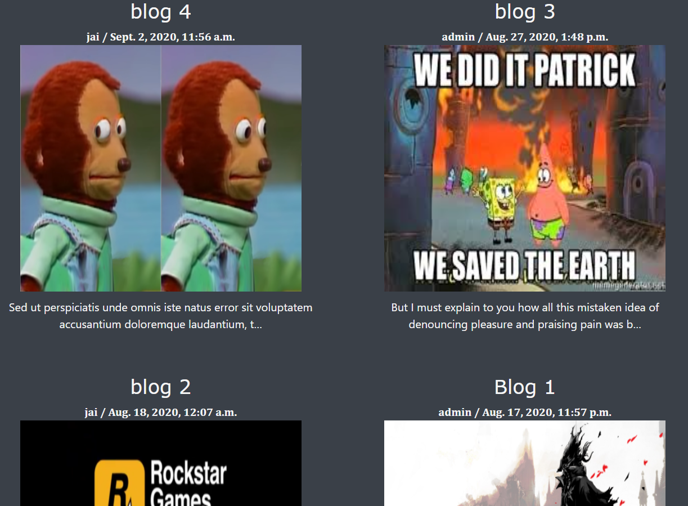
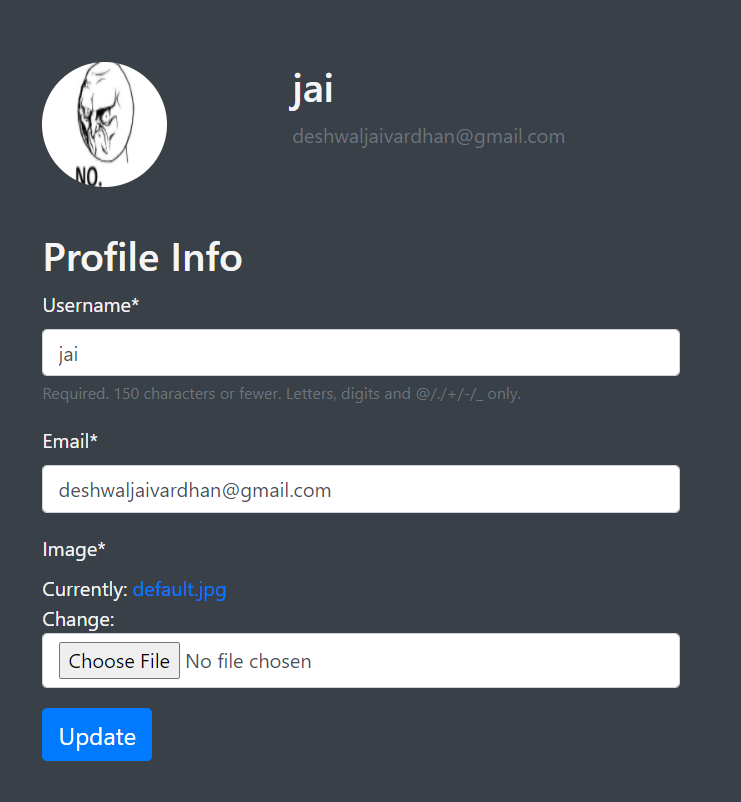
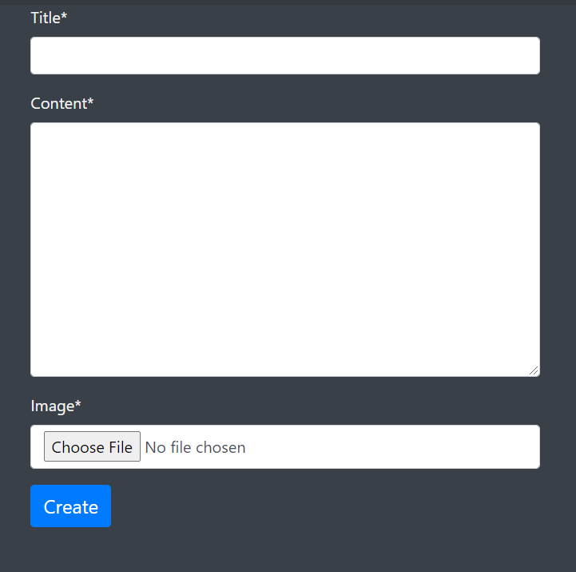

# Blogsite-Django
## https://thepsychocritique.herokuapp.com/
### *Note: This is the website implemented with slight changes*

 

## Blogsite where Users create their own account and make Posts, update Profiles, sort post by User, etc

 

## Front

 

## Blog posts listed sorted by date

 

## Login

 

## Register

 

## Profile of logged in User

 

## Creatinga new blog post

 

## Comment section for logged in users and Update, Delete if user is also the author of post.

 

## Password Reset

 

## Deleting the Post

 
